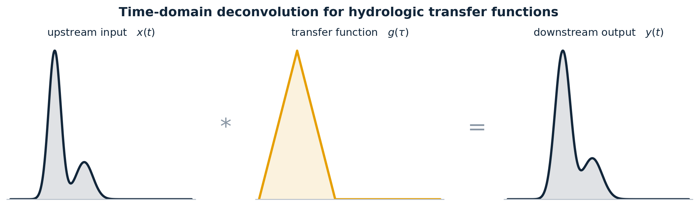

<p align="center">
  
</p>

# Deconvolution

## Time-Domain Deconvolution for Estimating Hydrologic Transfer Functions

This repository contains the complete workflow, Python environment, and datasets used to develop, test, and apply an improved time-domain deconvolution method for estimating transfer functions in hydrologic systems.

Deconvolution recovers how a tracer signal is transformed as it travels from an upstream input location to a downstream output location. Traditional approaches assume a fixed covariance structure for the transfer function — typically linear — which constrains the recovered kernels, especially under high noise. The method implemented here removes that assumption by solving for the actual autocovariance directly from the data, and adds a learned covariance estimator that improves the covariance at each iteration. The result is more robust and more stable across both synthetic and field datasets, with error bounds on the recovered kernels.

<br>

## Contents

| Path | Description |
| --- | --- |
| [`deconv_parallel.py`](deconv_parallel.py) | Main driver — the deconvolution solver and the run configuration for every case in the manuscript |
| [`py_plotting.py`](py_plotting.py) | All figure generation (kernel comparisons, input/output time series, covariance plots) |
| [`py_tables.py`](py_tables.py) | LaTeX tables and single-PDF table summaries per noise type |
| [`make_appendix_ng_fig.py`](make_appendix_ng_fig.py) | Appendix figure: sensitivity of each method to the chosen kernel length |
| [`known_kernels/`](known_kernels/) | Chapeau, gamma, and bimodal kernels used for synthetic testing and validation |
| [`field_studies/`](field_studies/) | Input data and results for the Gambill et al. (2025) field dataset |
| [`deconv_env.yml`](deconv_env.yml) | Conda/mamba environment specification |

<br>

## Methods

Three covariance treatments are implemented and compared:

* **COV-Learn** — learns the transfer-function covariance directly from the data, updating the empirical autocovariance of the kernel at every outer iteration. No assumed covariance shape.

* **Modified Cirpka** — a corrected form of the classical linear-variogram approach. The prior slope is estimated by maximum likelihood over only the non-zero kernel entries, which makes the estimate independent of the user's choice of kernel length.

* **Linear** — the classical fixed linear covariance structure, retained for comparison.

All methods enforce non-negativity of the transfer function through Lagrange multipliers and produce conditional realizations for uncertainty bounds.

<br>

## Getting Started

### Installing the Python environment

Any conda-compatible installer works. [Miniforge](https://github.com/conda-forge/miniforge) is recommended — it is open source, preconfigured for conda-forge, and uses the faster mamba solver.

```bash
mamba env create -f deconv_env.yml
mamba activate deconv_py311
```

or with conda:

```bash
conda env create -f deconv_env.yml
conda activate deconv_py311
```

### Running the workflow

```bash
python deconv_parallel.py
```

Case selection is controlled by the flags at the top of the `__main__` block in [`deconv_parallel.py`](deconv_parallel.py):

```python
run_knwn_kernels = True     # synthetic chapeau / gamma / bimodal cases
run_gambill      = False    # Gambill et al. (2025) field data
noise_type       = 'on-out' # 'on-out', 'on-in-before-conv', or 'on-in-after-conv'
run_in_parallel  = False    # multiprocess the conditional realizations
plot_figs        = True
```

Then generate the tables:

```bash
python py_tables.py
```

<br>

## Outputs

| Output | Location |
| --- | --- |
| Known-kernel figures | `known_kernels/python_make/figs_known_kernels/` |
| Known-kernel results and stats | `known_kernels/python_make/<kernel>/outputs/<noise_type>/` |
| LaTeX tables and PDF summaries | `known_kernels/python_make/latex_tables/<noise_type>/` |
| Gambill field figures | `field_studies/gambill/python_make/gambill_figs/` |
| Gambill results and stats | `field_studies/gambill/python_make/outputs/` |

<br>

## Notes on Parallel Execution

Setting `run_in_parallel = True` distributes the conditional realizations across processes. The solver pins BLAS to a single thread per worker, because the numerical libraries beneath NumPy and SciPy are already multithreaded — without this, workers oversubscribe the machine and forking a live BLAS thread pool can deadlock. `threadpoolctl` (included in the environment file) enforces this at runtime, which matters when the module is imported after NumPy, such as in a Jupyter session.

Each realization draws from its own independent random stream, so serial and parallel runs are statistically equivalent.

<br>

## MATLAB Implementation

The original MATLAB implementation of this method is maintained separately:

**https://github.com/**<!-- TODO: replace with the professor's repository URL -->

The MATLAB version is less automated — standalone scripts run each known transfer function example and each Gambill input/output tracer pair, and results are written to `.csv` and `.mat` files rather than plotted into manuscript figures. It does include live plotting at every sub-iteration of the solver, which is worth watching: a lot can be learned about a problem by observing the solution improve or derail as it steps through the sub-iterations.

<br>

## Validation

The Python implementation was validated against the MATLAB version using the synthetic test cases from the manuscript and the Gambill highQ_R1 field case. With matched settings the two recover effectively identical transfer functions, converged variogram slopes, and error bounds. Residual differences are expected and come from (i) the inability to enforce identical random seeds across platforms and (ii) small numerical differences between the SciPy and MATLAB optimization and linear-algebra routines.

<br>

## References

Harmon, R., Benson, D., and others (in preparation). *Improved time-domain deconvolution for hydrologic transfer functions.*

Gambill, D., and others (2025). *Field tracer dataset.*

<br>

## Citation

If you use this code, please cite the manuscript above and this repository.
